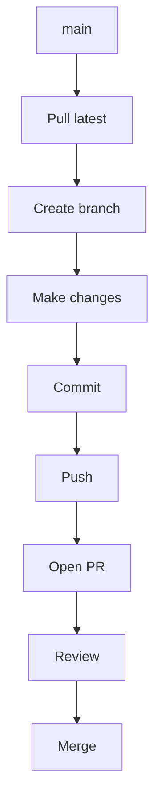

# PLEASE READ EVERYTHING, IT'S PRETTY IMPORTANT

## Before starting

Make sure you have Git installed. You can check by opening a terminal (any is fine) and running:

```bash
git --version
```

If you see:

```text
'git' is not recognized as an internal or external command...
```

that means you don't have Git installed.

> **NOTE:** If you downloaded Git but your VS Code was already open, you may need to restart VS Code before the terminal recognises `git`.

`main` is **protected** (nothing against you guys, it's just to avoid accidental overwrites), so you won't be able to push directly to it. Instead, every change should go through a **Pull Request (PR)**.

Whenever you start working on a **new feature or fix/tweak**, follow these steps.

> **NOTE:** You can follow this workflow using VS Code's Source Control interface if you prefer. The commands below are just the terminal equivalents.

## Step 0: Clone the repo

If you don't already have the project on your computer, clone it first.

1. Copy the repository URL from GitHub:
   - Click **Code**
   - Copy the HTTPS URL
2. Open a terminal in the folder where you want the project.
3. Run:

```git
git clone repository-url
```

Then you can enter the project folder by running:

```git
cd repository-name
```

After this, you can follow the normal workflow below.

## General Workflow (after cloning)



More detailed steps provided below.

## Step 1: Pull the latest version

First, make sure your local `main` branch is up to date so you're starting from the latest version of the project.

```git
git switch main
git pull origin main
```

## Step 2: Create a branch

Create a new branch for whatever you're working on. Replace `branch-name` with something descriptive (e.g. `tweak-css`, `add-about-me-page`, etc). Don't worry about it too much though, as long as I roughly get what the branch is for from the name it's good enough already.

Any later mention of `branch-name` should be replaced with the actual name of your branch (writing this just in case).

```git
git switch -c branch-name
```

## Step 3: Save changes

When you've made some changes, stage all your changes (that's `git add .`) and commit them.

```git
git add .
git commit -m "Describe your changes, blah blah blah"
```

You can commit as often as you like while you're working, as many times as you want. Do note that you can use `git status` at any time to see what files have changed.

## Step 4: Upload branch

When you're happy with your changes, run the following to push your branch (you really only have to do this once, but it doesn't matter if you accidentally do it again):

```git
git push -u origin branch-name
```

After pushing, GitHub will usually show a banner suggesting you create a PR. If not, open the repository on GitHub and create one manually.

## Step 5: Open a PR

1. Go to the GitHub repository.
2. Click **Compare & pull request** (or **Pull requests → New pull request**).
3. Ensure that:
   - Base: `main`
   - Compare: `branch-name`
4. Click **Create pull request**.

I'll review your changes and merge them if everything looks good.

After your PR is merged, GitHub may show a **Delete branch** button. It's safe to click, as your changes have already been merged into `main`, so this just cleans up the branch.

## Step 6: If changes are requested

Make the changes on the same branch, then run:

```git
git add .
git commit -m "Describe your changes, blah blah blah"
git push
```

Your PR will update automatically. Do not create another PR.

## IMPORTANT

- Do **not** push directly into `main`.
- Do **not** force push.
- Do **not** delete branches unless they've already been merged.
- Ideally, keep one feature or fix per branch, but don't worry too much about it honestly.
- If you're stuck or don't understand anything, you can ask me or like ~~ChatGPT~~ your best friend lol.
